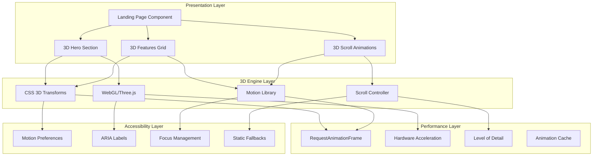

# Design Document

## Overview

This design document outlines the technical architecture for enhancing the ROOTS landing page with modern 3D visual elements, interactive animations, and immersive effects. The system will transform the current flat design into an engaging, three-dimensional experience while maintaining performance, accessibility, and cross-browser compatibility.

The design emphasizes:
- Performance-optimized 3D rendering using CSS 3D transforms and selective WebGL
- Progressive enhancement with graceful degradation for older browsers
- Accessibility-first approach with motion preferences and screen reader support
- Mobile-responsive 3D effects that adapt to device capabilities
- Smooth 60fps animations with hardware acceleration

## Architecture

### High-Level Architecture



### Technology Stack

- **3D Rendering**: CSS 3D Transforms (primary), React Three Fiber (selective)
- **Animation Library**: Framer Motion for React
- **Scroll Animations**: React Intersection Observer + Framer Motion
- **Performance**: RequestAnimationFrame, will-change CSS property
- **Fallbacks**: CSS @supports queries, JavaScript feature detection
- **Accessibility**: prefers-reduced-motion, ARIA labels, semantic markup

### Rendering Strategy

**Hybrid Approach**:
1. **CSS 3D Transforms**: For cards, buttons, and simple geometric effects
2. **WebGL/Three.js**: Only for complex 3D family tree visualization
3. **Progressive Enhancement**: Start with 2D, enhance with 3D when supported

## Components and Interfaces

### Enhanced Page Components

#### Hero3DSection
**Purpose**: Main hero area with 3D floating cards and family tree demonstration

**Props**:
- `reducedMotion: boolean` (from user preferences)
- `deviceCapabilities: DeviceCapabilities`

**State**:
- `mousePosition: { x: number, y: number }`
- `isTreeAnimating: boolean`
- `cardPositions: Array<CardPosition3D>`

**Key 3D Elements**:
- Floating profile cards with depth and shadows
- Animated connection lines between family members
- 3D family tree preview with rotation and zoom
- Parallax background layers

**Methods**:
- `handleMouseMove(event)`: Updates parallax and card tilt effects
- `animateTreeDemo()`: Orchestrates the family tree demonstration
- `updateCardPositions()`: Manages 3D positioning of floating cards

#### Features3DGrid
**Purpose**: Feature cards with 3D flip animations and hover effects

**Props**:
- `features: Array<FeatureData>`
- `inView: boolean` (from Intersection Observer)

**State**:
- `hoveredCard: string | null`
- `animationStates: Record<string, AnimationState>`

**3D Effects**:
- Card flip animations on scroll reveal
- Hover tilt and elevation effects
- Staggered entrance animations
- Depth-based layering

#### Scroll3DController
**Purpose**: Manages scroll-triggered 3D animations throughout the page

**Props**: None

**State**:
- `scrollProgress: number`
- `visibleSections: Set<string>`
- `animationQueue: Array<AnimationTask>`

**Methods**:
- `handleScroll()`: Calculates scroll progress and triggers animations
- `triggerSectionAnimation(sectionId)`: Initiates 3D effects for visible sections
- `optimizeAnimations()`: Manages performance by queuing and batching animations

### 3D Component Library

#### FloatingCard3D
**Purpose**: Reusable 3D card component with hover effects

**Props**:
- `content: ReactNode`
- `depth: number` (z-axis position)
- `tiltIntensity: number` (hover tilt amount)
- `shadowIntensity: number`
- `animationDelay: number`

**CSS Properties**:
```css
.floating-card-3d {
  transform-style: preserve-3d;
  perspective: 1000px;
  will-change: transform;
  transition: transform 0.3s cubic-bezier(0.4, 0, 0.2, 1);
}

.floating-card-3d:hover {
  transform: rotateX(var(--tilt-x)) rotateY(var(--tilt-y)) translateZ(20px);
}
```

#### Connection3DLine
**Purpose**: Animated 3D lines showing family relationships

**Props**:
- `startPoint: Point3D`
- `endPoint: Point3D`
- `animationDuration: number`
- `glowEffect: boolean`

**Animation States**:
- `drawing`: Line draws from start to end point
- `pulsing`: Subtle glow animation to indicate active connection
- `highlighted`: Enhanced visibility on hover

#### FamilyTree3DDemo
**Purpose**: Interactive 3D family tree visualization

**Props**:
- `treeData: FamilyTreeData`
- `autoRotate: boolean`
- `interactionEnabled: boolean`

**3D Features**:
- Multi-generational layout in 3D space
- Smooth camera movements and rotations
- Interactive node selection and highlighting
- Realistic lighting and shadows

### Animation System

#### AnimationController
**Purpose**: Central controller for all 3D animations

**Methods**:
- `registerAnimation(id, config)`: Registers new animation sequences
- `playAnimation(id, options)`: Executes animations with performance monitoring
- `pauseAllAnimations()`: Pauses animations for performance or accessibility
- `getAnimationState(id)`: Returns current state of specific animation

**Performance Features**:
- Animation batching to reduce layout thrashing
- Automatic frame rate monitoring and adjustment
- Memory cleanup for completed animations
- GPU acceleration detection and utilization

## Data Models

### 3D Positioning Types

```typescript
interface Point3D {
  x: number;
  y: number;
  z: number;
}

interface CardPosition3D extends Point3D {
  rotationX: number;
  rotationY: number;
  rotationZ: number;
  scale: number;
}

interface AnimationState {
  isPlaying: boolean;
  progress: number; // 0-1
  duration: number;
  easing: string;
  startTime: number;
}

interface DeviceCapabilities {
  supportsWebGL: boolean;
  supports3DTransforms: boolean;
  supportsHardwareAcceleration: boolean;
  maxTextureSize: number;
  devicePixelRatio: number;
  isMobile: boolean;
  prefersReducedMotion: boolean;
}
```

### Animation Configuration

```typescript
interface Animation3DConfig {
  id: string;
  type: '3d-transform' | 'webgl' | 'css-animation';
  duration: number;
  easing: string;
  keyframes: Array<Keyframe3D>;
  triggers: Array<AnimationTrigger>;
  performance: PerformanceConfig;
}

interface Keyframe3D {
  time: number; // 0-1
  transform: {
    translate: Point3D;
    rotate: Point3D;
    scale: Point3D;
  };
  opacity: number;
  filters?: Array<CSSFilter>;
}

interface PerformanceConfig {
  maxFPS: number;
  enableGPU: boolean;
  levelOfDetail: boolean;
  memoryLimit: number; // MB
}
```

### Family Tree Data

```typescript
interface FamilyTreeData {
  nodes: Array<FamilyNode3D>;
  connections: Array<Connection3D>;
  generations: Array<Generation>;
  metadata: TreeMetadata;
}

interface FamilyNode3D {
  id: string;
  name: string;
  photoUrl: string;
  position: Point3D;
  relationships: Array<string>; // IDs of connected nodes
  generation: number;
  animationDelay: number;
}

interface Connection3D {
  id: string;
  fromNodeId: string;
  toNodeId: string;
  type: 'parent' | 'child' | 'spouse' | 'sibling';
  path: Array<Point3D>; // Bezier curve points
  animationConfig: ConnectionAnimationConfig;
}
```

## Correctness Properties

*A property is a characteristic or behavior that should hold true across all valid executions of a system—essentially, a formal statement about what the system should do. Properties serve as the bridge between human-readable specifications and machine-verifiable correctness guarantees.*

Now I need to use the prework tool to analyze the acceptance criteria before writing the correctness properties:

<function_calls>
<invoke name="prework">
<parameter name="featureName">landing-3d-enhancements

### Property 1: 3D profile cards render with depth effects
*For any* landing page load, all profile cards in the hero section should have CSS 3D transform properties applied and visible shadow effects.
**Validates: Requirements 1.1**

### Property 2: Connection lines animate consistently
*For any* hero section render, connection lines between family member cards should have animation properties applied and be visually pulsing.
**Validates: Requirements 1.2**

### Property 3: Family tree displays 3D rotation
*For any* hero visual display, the 3D family tree preview should have rotation animations active and multiple depth layers visible.
**Validates: Requirements 1.3**

### Property 4: Profile cards maintain consistent 3D properties
*For any* profile card displayed, it should have proper perspective, shadow, and floating animation CSS properties applied.
**Validates: Requirements 1.4**

### Property 5: Entrance animations complete within time limit
*For any* page load, all 3D element entrance animations should complete within 2 seconds total duration.
**Validates: Requirements 1.5**

### Property 6: Card hover effects apply 3D transformations
*For any* floating profile card hover event, the card should receive tilt and elevation transform values with smooth transitions.
**Validates: Requirements 2.1**

### Property 7: Mouse movement triggers parallax effects
*For any* mouse movement across the hero section, background elements should receive transform changes proportional to mouse position.
**Validates: Requirements 2.2**

### Property 8: Scroll events trigger 3D animations
*For any* scroll event, 3D elements should receive transform changes that correspond to scroll position and depth.
**Validates: Requirements 2.3**

### Property 9: Connection line hover highlights
*For any* connection line hover event, the line should receive increased opacity and glow effects.
**Validates: Requirements 2.4**

### Property 10: Interactive elements provide micro-feedback
*For any* interactive element engagement, micro-animations should be triggered with appropriate visual feedback.
**Validates: Requirements 2.5**

### Property 11: Feature cards animate on scroll reveal
*For any* feature card coming into view, it should receive 3D flip animation properties when the features section is scrolled into view.
**Validates: Requirements 3.1**

### Property 12: Statistics animate with 3D effects
*For any* statistics section becoming visible, number elements should receive 3D counter animations and floating emphasis effects.
**Validates: Requirements 3.2**

### Property 13: Testimonials display staggered animations
*For any* testimonial cards scrolled into view, they should animate with proper delay intervals between each card.
**Validates: Requirements 3.3**

### Property 14: CTA button lifts with 3D effect
*For any* CTA section becoming visible, the call-to-action button should receive 3D transform properties that create a lifting effect.
**Validates: Requirements 3.4**

### Property 15: Text readability maintained during animations
*For any* active 3D animation, text elements should maintain required contrast ratios and stable positioning without unexpected movement.
**Validates: Requirements 4.1**

### Property 16: Layout structure preserved with 3D effects
*For any* applied interactive effect, the original document flow and accessibility tree structure should remain intact.
**Validates: Requirements 4.2**

### Property 17: Important elements remain unobstructed
*For any* rendered 3D element, important text and call-to-action buttons should remain accessible and visible with proper z-index values.
**Validates: Requirements 4.3**

### Property 18: Motion preferences respected
*For any* user with prefers-reduced-motion setting, animations should be disabled and static alternatives should be provided.
**Validates: Requirements 4.4**

### Property 19: Mobile devices receive adapted effects
*For any* mobile device view, 3D effects should be optimized with touch-appropriate interactions and mobile-specific styling.
**Validates: Requirements 4.5**

### Property 20: 3D elements have accessibility markup
*For any* 3D visual element, appropriate ARIA attributes and descriptions should be present for screen reader access.
**Validates: Requirements 5.1**

### Property 21: Focus indicators work with 3D transforms
*For any* 3D transformed element, keyboard focus indicators should remain visible and properly positioned.
**Validates: Requirements 5.2**

### Property 22: Motion sensitivity preferences honored
*For any* user with motion sensitivity, reduced motion preferences should disable animations and show static versions.
**Validates: Requirements 5.3**

### Property 23: 3D elements support keyboard navigation
*For any* interactive 3D element, it should be reachable and activatable via keyboard navigation.
**Validates: Requirements 5.4**

### Property 24: Semantic markup describes 3D relationships
*For any* 3D visual relationship, the DOM structure should provide semantic markup that describes the visual connections.
**Validates: Requirements 5.5**

### Property 25: Desktop browsers render full 3D effects
*For any* desktop browser with hardware acceleration support, full 3D effects should be applied with GPU optimization.
**Validates: Requirements 6.1**

### Property 26: Mobile devices receive optimized effects
*For any* mobile device, 3D effects should be optimized based on device capabilities while maintaining performance.
**Validates: Requirements 6.2**

### Property 27: Unsupported browsers gracefully degrade
*For any* browser without advanced 3D support, 2D alternatives should be provided without breaking functionality.
**Validates: Requirements 6.3**

### Property 28: Viewport changes adapt 3D elements
*For any* viewport size change, 3D elements should adjust positioning and scale appropriately to the new dimensions.
**Validates: Requirements 6.4**

### Property 29: High-DPI displays render crisp graphics
*For any* high-DPI display, 3D elements should be rendered with appropriately scaled, high-resolution graphics.
**Validates: Requirements 6.5**

### Property 30: Family tree nodes positioned with depth
*For any* hero section display, family tree nodes should have proper z-depth values creating realistic spatial depth.
**Validates: Requirements 7.1**

### Property 31: New family members animate smoothly
*For any* family tree demo visibility, new family member additions should appear with expected 3D transition effects.
**Validates: Requirements 7.2**

### Property 32: Connection lines curve in 3D space
*For any* family tree observation, connection lines should have proper 3D curves and positioning between nodes.
**Validates: Requirements 7.3**

### Property 33: Tree demo shows smooth camera movements
*For any* demo playback, rotation and zoom animations should be applied smoothly to demonstrate tree interaction.
**Validates: Requirements 7.4**

### Property 34: Demo completion provides continuation
*For any* demonstration completion, the demo should either loop seamlessly or provide interactive controls for exploration.
**Validates: Requirements 7.5**

### Property 35: Hardware acceleration utilized when available
*For any* 3D element rendering, GPU-accelerated properties should be applied when hardware acceleration is supported.
**Validates: Requirements 8.1**

### Property 36: Critical content loads before 3D effects
*For any* page load, essential content should appear before 3D enhancements are initialized and applied.
**Validates: Requirements 8.2**

### Property 37: Efficient rendering techniques used
*For any* multiple visible 3D elements, efficient techniques like batching and culling should be employed to minimize performance impact.
**Validates: Requirements 8.4**

### Property 38: Progressive enhancement on slow connections
*For any* slow connection page load, basic content should load first before 3D features are initialized.
**Validates: Requirements 8.5**

### Property 39: Lighting follows consistent direction
*For any* displayed 3D element, lighting effects should follow consistent directional patterns across all elements.
**Validates: Requirements 9.1**

### Property 40: Shadows respond to card transformations
*For any* floating card render, drop shadows should update dynamically based on the card's position and rotation.
**Validates: Requirements 9.2**

### Property 41: Hover states adjust lighting appropriately
*For any* interactive element hover, lighting and shadow effects should change to reinforce the 3D interaction.
**Validates: Requirements 9.3**

### Property 42: Lighting complements theme colors
*For any* page theme application, 3D lighting colors should match and complement the overall color scheme and branding.
**Validates: Requirements 9.4**

### Property 43: Content remains readable under lighting changes
*For any* ambient lighting change, all content should maintain readability and visual hierarchy.
**Validates: Requirements 9.5**

### Property 44: Connection lines curve between related cards
*For any* family member card display, 3D connection lines should be properly curved and positioned between related individuals.
**Validates: Requirements 10.1**

### Property 45: Connections show appropriate visual effects
*For any* animated connection, flowing particle effects or glowing trails should be applied to indicate relationship strength.
**Validates: Requirements 10.2**

### Property 46: Generations arranged in distinct layers
*For any* multiple generation display, different generations should have distinct z-depth positioning in 3D space.
**Validates: Requirements 10.3**

### Property 47: Relationship types have distinct styling
*For any* relationship type demonstration, parent-child, sibling, and spousal connections should have different visual styling.
**Validates: Requirements 10.4**

### Property 48: Connection visualization tells temporal story
*For any* connection visualization playback, connections should appear in a logical temporal sequence showing family growth over time.
**Validates: Requirements 10.5**

## Error Handling

### 3D Capability Detection

**Browser Support Detection**:
```javascript
const detect3DSupport = () => {
  const canvas = document.createElement('canvas');
  const gl = canvas.getContext('webgl') || canvas.getContext('experimental-webgl');
  
  return {
    webgl: !!gl,
    css3d: 'transform' in document.body.style && 'perspective' in document.body.style,
    hardwareAcceleration: !!gl && gl.getParameter(gl.MAX_TEXTURE_SIZE) > 1024
  };
};
```

**Graceful Degradation Strategy**:
1. **Full 3D**: WebGL + CSS 3D transforms for capable browsers
2. **CSS 3D Only**: CSS transforms without WebGL for mid-range support
3. **2D Fallback**: Static images and CSS transitions for older browsers
4. **Accessibility Mode**: Static content with semantic markup only

### Performance Error Handling

**Frame Rate Monitoring**:
- Automatic detection of performance drops below 30fps
- Dynamic reduction of animation complexity
- Fallback to simpler effects when performance degrades

**Memory Management**:
- Cleanup of unused animation objects
- Texture and geometry disposal for WebGL elements
- Event listener removal on component unmount

**Error Recovery**:
- Try-catch blocks around 3D initialization
- Fallback rendering when WebGL context is lost
- Graceful handling of CSS transform failures

### Accessibility Error Handling

**Motion Preference Detection**:
```css
@media (prefers-reduced-motion: reduce) {
  .floating-card-3d {
    animation: none;
    transform: none;
  }
  
  .connection-line {
    animation: none;
  }
}
```

**Screen Reader Compatibility**:
- Alternative text descriptions for 3D visualizations
- Skip links for users who cannot perceive 3D effects
- Semantic markup that describes spatial relationships

## Testing Strategy

### Unit Testing

**3D Component Testing**:
- Test that 3D components render without crashing
- Verify CSS 3D transform properties are applied correctly
- Test hover and interaction state changes
- Validate animation timing and duration constraints
- Test responsive behavior across different viewport sizes

**Animation System Testing**:
- Test animation controller registration and playback
- Verify performance monitoring and frame rate detection
- Test animation cleanup and memory management
- Validate graceful degradation when features are unsupported

**Accessibility Testing**:
- Test motion preference detection and respect
- Verify ARIA labels and semantic markup
- Test keyboard navigation with 3D transformed elements
- Validate screen reader compatibility

### Property-Based Testing

The system will use **fast-check** (for JavaScript/TypeScript) as the property-based testing library. Each property-based test will run a minimum of 100 iterations to ensure comprehensive coverage across the input space.

**Property Test Implementation Requirements**:
- Each correctness property must be implemented as a single property-based test
- Each test must be tagged with a comment referencing the design document property
- Tag format: `// Feature: landing-3d-enhancements, Property [number]: [property text]`
- Tests should use smart generators that create realistic 3D scenarios

**Key Property Tests**:

1. **3D Transform Property Test**:
   - Generate random card positions and rotations
   - Verify all cards receive proper 3D transform CSS properties
   - Tag: `// Feature: landing-3d-enhancements, Property 1: 3D profile cards render with depth effects`

2. **Animation Timing Property Test**:
   - Generate various page load scenarios
   - Verify entrance animations complete within 2-second limit
   - Tag: `// Feature: landing-3d-enhancements, Property 5: Entrance animations complete within time limit`

3. **Hover Interaction Property Test**:
   - Generate random hover events on interactive elements
   - Verify appropriate 3D transformations are applied
   - Tag: `// Feature: landing-3d-enhancements, Property 6: Card hover effects apply 3D transformations`

4. **Accessibility Property Test**:
   - Generate various motion preference settings
   - Verify animations are disabled when prefers-reduced-motion is set
   - Tag: `// Feature: landing-3d-enhancements, Property 18: Motion preferences respected`

5. **Responsive Behavior Property Test**:
   - Generate various viewport sizes and device types
   - Verify 3D elements adapt appropriately
   - Tag: `// Feature: landing-3d-enhancements, Property 28: Viewport changes adapt 3D elements`

### Integration Testing

**3D Animation Flow**:
- Test complete scroll-triggered animation sequences
- Test interaction between different 3D components
- Test performance under various device capabilities
- Test graceful degradation across browser support levels

**Cross-Browser Compatibility**:
- Test 3D effects on Chrome, Firefox, Safari, Edge
- Test WebGL fallback behavior
- Test mobile browser performance and touch interactions

### Performance Testing

**Frame Rate Monitoring**:
- Automated testing of animation performance
- Memory usage tracking during 3D operations
- GPU utilization monitoring when available

**Load Testing**:
- Test 3D initialization time on various connection speeds
- Test progressive enhancement loading behavior
- Test performance with multiple simultaneous animations

### Visual Regression Testing

**3D Rendering Consistency**:
- Screenshot comparison testing for 3D visual elements
- Cross-browser visual consistency validation
- Mobile vs desktop rendering comparison

## Security Considerations

### WebGL Security

**Context Validation**:
- Validate WebGL context before use
- Handle context loss gracefully
- Prevent shader injection through user input

**Resource Limits**:
- Limit texture sizes and geometry complexity
- Prevent memory exhaustion through animation limits
- Monitor GPU memory usage

### Performance Security

**DoS Prevention**:
- Rate limiting on animation triggers
- Maximum concurrent animation limits
- Automatic performance degradation under load

## Performance Considerations

### 3D Optimization Strategies

**Hardware Acceleration**:
- Use `will-change` CSS property for animated elements
- Leverage `transform3d()` to trigger GPU acceleration
- Batch DOM updates to minimize layout thrashing

**Level of Detail (LOD)**:
- Reduce animation complexity based on device capabilities
- Use simpler effects on mobile devices
- Progressive enhancement based on performance monitoring

**Memory Management**:
- Cleanup unused animation objects
- Dispose of WebGL resources properly
- Use object pooling for frequently created/destroyed elements

### Loading Optimization

**Progressive Enhancement**:
1. Load critical content first
2. Initialize basic CSS animations
3. Load WebGL resources asynchronously
4. Apply advanced 3D effects when ready

**Resource Prioritization**:
- Preload essential 3D assets
- Lazy load complex animations
- Use intersection observer for scroll-triggered effects

## Accessibility

### Motion and Animation

**Reduced Motion Support**:
- Respect `prefers-reduced-motion` media query
- Provide static alternatives for all animations
- Allow manual animation control

**Cognitive Accessibility**:
- Limit simultaneous animations to prevent overwhelm
- Provide clear visual hierarchy even with 3D effects
- Ensure animations enhance rather than distract from content

### Screen Reader Support

**Semantic Markup**:
- Use ARIA labels to describe 3D spatial relationships
- Provide alternative text for visual-only 3D content
- Maintain logical tab order despite 3D transformations

**Focus Management**:
- Ensure focus indicators work with 3D transforms
- Provide skip links for complex 3D sections
- Maintain keyboard navigation functionality

## Future Enhancements

### Phase 2 Features

**Advanced 3D Interactions**:
- Touch gesture support for 3D manipulation
- Voice control for accessibility
- Eye tracking integration for immersive experiences

**Enhanced Visualizations**:
- Particle systems for connection effects
- Realistic physics simulations
- Dynamic lighting based on time of day

### Phase 3 Features

**VR/AR Integration**:
- WebXR support for immersive family tree exploration
- Augmented reality family photo overlays
- Virtual reality family gathering spaces

**AI-Enhanced 3D**:
- Machine learning-based animation optimization
- Intelligent performance adaptation
- Personalized 3D experience customization