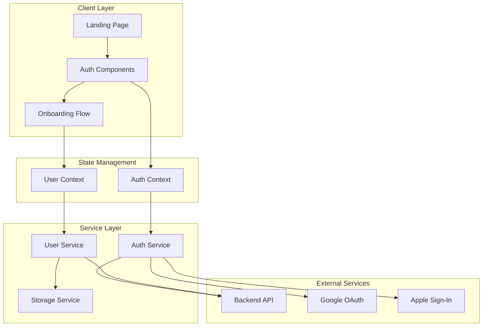

# Design Document

## Overview

This design document outlines the technical architecture for the ROOTS landing page, authentication system, and user onboarding flow. The system is built as a React-based single-page application (SPA) using Vite as the build tool. The architecture follows a component-based approach with clear separation between presentation, business logic, and data management layers.

The design emphasizes:
- Clean component architecture with reusable UI elements
- Secure authentication with multiple providers (email/password, Google, Apple)
- Client-side form validation with real-time feedback
- Responsive design for mobile and desktop experiences
- State management for authentication and user profile data

## Architecture

### High-Level Architecture



### Technology Stack

- **Frontend Framework**: React 18+ with JSX
- **Build Tool**: Vite
- **Routing**: React Router v6
- **State Management**: React Context API
- **Form Management**: React Hook Form
- **Validation**: Zod schema validation
- **HTTP Client**: Axios
- **Authentication**: Firebase Auth (for SSO) or custom JWT implementation
- **Styling**: CSS Modules or Tailwind CSS
- **Image Upload**: Browser File API with client-side compression

## Components and Interfaces

### Page Components

#### LandingPage
**Purpose**: Public-facing homepage that introduces ROOTS and drives conversions

**Props**: None

**State**:
- None (stateless presentation component)

**Key Elements**:
- Hero section with tagline and CTA buttons
- Statistics section (2M+ families, 50M+ trees, 150+ countries)
- Features grid (Interactive Tree, Privacy First, Collaborative Albums, Audio Stories)
- Conversion section with "Ready to plant your tree?" CTA
- Navigation header with Login/Get Started buttons

#### SignUpPage
**Purpose**: Account creation form with email/password and SSO options

**Props**: None

**State**:
- `formData: { fullName: string, email: string, password: string }`
- `errors: Record<string, string>`
- `isSubmitting: boolean`

**Methods**:
- `handleSubmit(data)`: Validates and submits account creation
- `handleGoogleSignUp()`: Initiates Google OAuth flow
- `handleAppleSignUp()`: Initiates Apple Sign-In flow

#### SignInPage
**Purpose**: Login form for returning users

**Props**: None

**State**:
- `formData: { email: string, password: string }`
- `errors: Record<string, string>`
- `isSubmitting: boolean`

**Methods**:
- `handleSubmit(data)`: Authenticates user credentials
- `handleGoogleSignIn()`: Initiates Google OAuth flow
- `handleAppleSignIn()`: Initiates Apple Sign-In flow

#### ForgotPasswordPage
**Purpose**: Password reset request and confirmation flow

**Props**: None

**State**:
- `email: string`
- `resetSent: boolean`
- `errors: Record<string, string>`

**Methods**:
- `handleResetRequest(email)`: Sends password reset email

#### ProfileSetupPage
**Purpose**: Collects user profile information after account creation

**Props**: None

**State**:
- `profileData: { firstName: string, lastName: string, dateOfBirth: string, gender: string, placeOfBirth: string, photo: File | null }`
- `photoPreview: string | null`
- `errors: Record<string, string>`
- `isSubmitting: boolean`

**Methods**:
- `handlePhotoUpload(file)`: Validates and previews profile photo
- `handleSubmit(data)`: Saves profile and navigates to success screen
- `handleSkip()`: Skips profile setup and navigates to dashboard

#### OnboardingSuccessPage
**Purpose**: Confirmation screen with next action options

**Props**:
- `user: User` (from context)

**State**: None

**Methods**:
- `handleStartNewTree()`: Navigates to tree creation
- `handleJoinTree()`: Navigates to invite code entry
- `handleSkipToDashboard()`: Navigates to dashboard

### Shared Components

#### Button
**Props**:
- `variant: 'primary' | 'secondary' | 'outline'`
- `size: 'small' | 'medium' | 'large'`
- `onClick: () => void`
- `disabled: boolean`
- `children: ReactNode`

#### Input
**Props**:
- `type: 'text' | 'email' | 'password' | 'date'`
- `label: string`
- `placeholder: string`
- `value: string`
- `onChange: (value: string) => void`
- `error: string | null`
- `required: boolean`

#### Select
**Props**:
- `label: string`
- `options: Array<{ value: string, label: string }>`
- `value: string`
- `onChange: (value: string) => void`
- `error: string | null`
- `placeholder: string`

#### ImageUpload
**Props**:
- `onUpload: (file: File) => void`
- `preview: string | null`
- `maxSize: number` (in MB)
- `error: string | null`

#### SSOButton
**Props**:
- `provider: 'google' | 'apple'`
- `onClick: () => void`
- `disabled: boolean`

#### FormError
**Props**:
- `message: string`

#### StepIndicator
**Props**:
- `currentStep: number`
- `totalSteps: number`

### Context Providers

#### AuthContext
**Purpose**: Manages authentication state across the application

**State**:
- `user: User | null`
- `isAuthenticated: boolean`
- `isLoading: boolean`
- `error: string | null`

**Methods**:
- `signUp(email, password, fullName): Promise<User>`
- `signIn(email, password): Promise<User>`
- `signInWithGoogle(): Promise<User>`
- `signInWithApple(): Promise<User>`
- `signOut(): Promise<void>`
- `resetPassword(email): Promise<void>`
- `updatePassword(token, newPassword): Promise<void>`

#### UserContext
**Purpose**: Manages user profile data and preferences

**State**:
- `profile: UserProfile | null`
- `isLoading: boolean`

**Methods**:
- `updateProfile(data: Partial<UserProfile>): Promise<void>`
- `uploadProfilePhoto(file: File): Promise<string>`

### Service Layer

#### AuthService
**Purpose**: Handles all authentication-related API calls

**Methods**:
- `register(email, password, fullName): Promise<AuthResponse>`
- `login(email, password): Promise<AuthResponse>`
- `loginWithGoogle(token): Promise<AuthResponse>`
- `loginWithApple(token): Promise<AuthResponse>`
- `logout(): Promise<void>`
- `requestPasswordReset(email): Promise<void>`
- `resetPassword(token, newPassword): Promise<void>`
- `refreshToken(): Promise<string>`

#### UserService
**Purpose**: Handles user profile operations

**Methods**:
- `getProfile(userId): Promise<UserProfile>`
- `updateProfile(userId, data): Promise<UserProfile>`
- `uploadPhoto(file): Promise<string>`

#### ValidationService
**Purpose**: Centralized validation logic

**Methods**:
- `validateEmail(email): ValidationResult`
- `validatePassword(password): ValidationResult`
- `validateRequired(value, fieldName): ValidationResult`
- `validateFileSize(file, maxSizeMB): ValidationResult`
- `validateFileType(file, allowedTypes): ValidationResult`

## Data Models

### User
```typescript
interface User {
  id: string;
  email: string;
  fullName: string;
  authProvider: 'email' | 'google' | 'apple';
  createdAt: Date;
  lastLoginAt: Date;
  emailVerified: boolean;
}
```

### UserProfile
```typescript
interface UserProfile {
  userId: string;
  firstName: string;
  lastName: string;
  dateOfBirth: string; // ISO 8601 format
  gender: 'male' | 'female' | 'other' | 'prefer-not-to-say';
  placeOfBirth: string;
  photoUrl: string | null;
  isComplete: boolean;
  createdAt: Date;
  updatedAt: Date;
}
```

### AuthResponse
```typescript
interface AuthResponse {
  user: User;
  accessToken: string;
  refreshToken: string;
  expiresIn: number;
}
```

### ValidationResult
```typescript
interface ValidationResult {
  isValid: boolean;
  error: string | null;
}
```

### FormData Types

```typescript
interface SignUpFormData {
  fullName: string;
  email: string;
  password: string;
}

interface SignInFormData {
  email: string;
  password: string;
}

interface ProfileSetupFormData {
  firstName: string;
  lastName: string;
  dateOfBirth: string;
  gender: string;
  placeOfBirth: string;
  photo: File | null;
}
```


## Correctness Properties

*A property is a characteristic or behavior that should hold true across all valid executions of a system—essentially, a formal statement about what the system should do. Properties serve as the bridge between human-readable specifications and machine-verifiable correctness guarantees.*

### Property 1: Valid account creation succeeds
*For any* valid user data (full name, email, password), submitting the account creation form should create a new user account and navigate to the profile setup page.
**Validates: Requirements 2.3**

### Property 2: Invalid email formats are rejected
*For any* string that does not match valid email format, the system should reject it and display a validation error message.
**Validates: Requirements 2.5**

### Property 3: SSO success creates account
*For any* successful SSO authentication response (Google or Apple), the system should create a user account and navigate to profile setup.
**Validates: Requirements 3.4**

### Property 4: SSO failure shows error
*For any* failed SSO authentication response, the system should display an error message and remain on the account creation form.
**Validates: Requirements 3.5**

### Property 5: Valid credentials authenticate successfully
*For any* valid user credentials (email and password), submitting the sign-in form should authenticate the user and navigate to the dashboard.
**Validates: Requirements 4.3**

### Property 6: Invalid credentials are rejected
*For any* invalid credential combination, the system should display an error message and keep the user on the sign-in form.
**Validates: Requirements 4.4**

### Property 7: Password reset sends email
*For any* registered email address, submitting a password reset request should trigger an email with a reset link to that address.
**Validates: Requirements 5.2**

### Property 8: Valid password update succeeds
*For any* valid new password and valid reset token, submitting the password reset form should update the user's password and navigate to the sign-in form.
**Validates: Requirements 5.4**

### Property 9: Valid profile data saves successfully
*For any* valid profile data (first name, last name, date of birth, gender, place of birth), submitting the profile setup form should save the profile and navigate to the success screen.
**Validates: Requirements 6.4**

### Property 10: Success message is personalized
*For any* user with a first name, the success screen should display "You're all set, [firstName]!" with the user's actual first name.
**Validates: Requirements 7.1**

### Property 11: Short passwords are rejected
*For any* password with fewer than 8 characters, the system should reject it and display a validation error.
**Validates: Requirements 8.1**

### Property 12: Passwords without required characters are rejected
*For any* password missing at least one uppercase letter, one lowercase letter, or one number, the system should reject it and display validation feedback.
**Validates: Requirements 8.2**

### Property 13: Invalid passwords show feedback
*For any* password that does not meet requirements, the system should display validation feedback indicating what is missing.
**Validates: Requirements 8.3**

### Property 14: Passwords are hashed before storage
*For any* password being stored, the system should hash it using a secure algorithm before persisting to storage.
**Validates: Requirements 8.4**

### Property 15: Authentication uses hashed comparison
*For any* authentication attempt, the system should compare the hashed input password with the stored hash, not plaintext.
**Validates: Requirements 8.5**

### Property 16: Invalid field data shows inline errors
*For any* form field with invalid data, the system should display an inline error message below that field.
**Validates: Requirements 9.1**

### Property 17: Empty required fields show errors
*For any* required field left empty on form submission, the system should display an error message indicating the field is required.
**Validates: Requirements 9.2**

### Property 18: Invalid email shows specific message
*For any* invalid email format, the system should display "Please enter a valid email address".
**Validates: Requirements 9.3**

### Property 19: Correcting fields clears errors
*For any* form field with an error, entering valid data should remove the error message for that field.
**Validates: Requirements 9.4**

### Property 20: Valid forms enable submit button
*For any* form where all fields are valid, the submit button should be enabled.
**Validates: Requirements 9.5**

### Property 21: Valid images show preview
*For any* valid image file selected for upload, the system should display a preview of that image.
**Validates: Requirements 10.3**

### Property 22: Non-image files are rejected
*For any* non-image file type uploaded, the system should display an error message indicating only image files are accepted.
**Validates: Requirements 10.5**

## Error Handling

### Client-Side Validation Errors

**Email Validation**:
- Invalid format: "Please enter a valid email address"
- Empty field: "Email is required"
- Already exists: "An account with this email already exists"

**Password Validation**:
- Too short: "Password must be at least 8 characters"
- Missing uppercase: "Password must contain at least one uppercase letter"
- Missing lowercase: "Password must contain at least one lowercase letter"
- Missing number: "Password must contain at least one number"
- Empty field: "Password is required"

**Profile Field Validation**:
- Empty required field: "[Field name] is required"
- Invalid date format: "Please enter a valid date (MM/DD/YYYY)"
- Future date of birth: "Date of birth cannot be in the future"

**File Upload Validation**:
- File too large: "Image must be smaller than 5MB"
- Invalid file type: "Only image files are accepted (JPG, PNG, GIF)"
- Upload failed: "Failed to upload image. Please try again"

### API Error Handling

**Network Errors**:
- Connection timeout: "Connection timed out. Please check your internet connection"
- Server unavailable: "Service temporarily unavailable. Please try again later"

**Authentication Errors**:
- Invalid credentials: "Invalid email or password"
- Account locked: "Your account has been locked. Please contact support"
- Session expired: "Your session has expired. Please sign in again"

**SSO Errors**:
- OAuth cancelled: "Sign-in was cancelled"
- OAuth failed: "Failed to sign in with [Provider]. Please try again"
- Account linking conflict: "An account with this email already exists"

**Rate Limiting**:
- Too many attempts: "Too many attempts. Please try again in [X] minutes"

### Error Display Strategy

1. **Inline Errors**: Display validation errors directly below form fields
2. **Toast Notifications**: Show temporary notifications for API errors and success messages
3. **Error Boundaries**: Catch and display React component errors gracefully
4. **Fallback UI**: Provide fallback content when components fail to load

## Testing Strategy

### Unit Testing

**Component Testing**:
- Test that each page component renders without crashing
- Test that form components handle user input correctly
- Test that validation logic works for individual fields
- Test that navigation functions are called with correct parameters
- Test that error states display appropriate messages

**Service Testing**:
- Test that AuthService methods call API endpoints with correct parameters
- Test that UserService handles profile updates correctly
- Test that ValidationService returns correct validation results
- Test that error responses are handled appropriately

**Context Testing**:
- Test that AuthContext provides correct authentication state
- Test that UserContext manages profile data correctly
- Test that context methods update state as expected

### Property-Based Testing

The system will use **fast-check** (for JavaScript/TypeScript) as the property-based testing library. Each property-based test will run a minimum of 100 iterations to ensure comprehensive coverage across the input space.

**Property Test Implementation Requirements**:
- Each correctness property must be implemented as a single property-based test
- Each test must be tagged with a comment referencing the design document property
- Tag format: `// Feature: landing-auth-onboarding, Property [number]: [property text]`
- Tests should use smart generators that constrain to valid input spaces

**Key Property Tests**:

1. **Account Creation Property Test**:
   - Generate random valid user data (names, emails, passwords)
   - Verify account creation succeeds and navigates correctly
   - Tag: `// Feature: landing-auth-onboarding, Property 1: Valid account creation succeeds`

2. **Email Validation Property Test**:
   - Generate various invalid email formats
   - Verify all are rejected with appropriate error messages
   - Tag: `// Feature: landing-auth-onboarding, Property 2: Invalid email formats are rejected`

3. **Password Validation Property Test**:
   - Generate passwords with various lengths and character combinations
   - Verify validation rules are enforced correctly
   - Tag: `// Feature: landing-auth-onboarding, Property 11-13: Password validation`

4. **Form Validation Property Test**:
   - Generate various invalid form inputs
   - Verify inline errors appear and clear correctly
   - Tag: `// Feature: landing-auth-onboarding, Property 16-20: Form validation`

5. **Profile Data Property Test**:
   - Generate random valid profile data
   - Verify profile saves and success screen displays correctly
   - Tag: `// Feature: landing-auth-onboarding, Property 9-10: Profile setup`

### Integration Testing

**Authentication Flow**:
- Test complete sign-up flow from landing page to success screen
- Test complete sign-in flow from login to dashboard
- Test password reset flow end-to-end
- Test SSO flows with mocked OAuth providers

**Navigation Flow**:
- Test routing between all pages
- Test protected route access
- Test redirect behavior for authenticated/unauthenticated users

**State Management**:
- Test that authentication state persists across page refreshes
- Test that user profile data is accessible throughout the app
- Test that logout clears all user data

### End-to-End Testing

**Critical User Journeys**:
1. New user signs up with email → completes profile → reaches success screen
2. Returning user signs in → navigates to dashboard
3. User forgets password → resets password → signs in successfully
4. New user signs up with Google → completes profile → reaches success screen

**Browser Compatibility**:
- Test on Chrome, Firefox, Safari, Edge
- Test responsive design on mobile and desktop viewports

### Test Coverage Goals

- Unit test coverage: 80%+ for business logic
- Component test coverage: 70%+ for UI components
- Property-based tests: All 22 correctness properties implemented
- Integration tests: All critical user flows covered
- E2E tests: 4 primary user journeys automated

## Security Considerations

### Password Security

- Passwords hashed using bcrypt with salt rounds ≥ 10
- Password requirements enforce strong passwords (8+ chars, mixed case, numbers)
- Password reset tokens expire after 1 hour
- Rate limiting on password reset requests (max 3 per hour per email)

### Authentication Security

- JWT tokens with short expiration (15 minutes for access, 7 days for refresh)
- Secure HTTP-only cookies for token storage
- CSRF protection on all authenticated endpoints
- Rate limiting on login attempts (max 5 per 15 minutes per IP)

### Data Protection

- All API communication over HTTPS
- Profile photos stored with unique identifiers (no user data in filenames)
- Input sanitization to prevent XSS attacks
- SQL injection prevention through parameterized queries

### SSO Security

- OAuth state parameter validation to prevent CSRF
- Verify OAuth tokens with provider before creating accounts
- Secure storage of OAuth client secrets (environment variables)

## Performance Considerations

### Client-Side Optimization

- Code splitting for route-based lazy loading
- Image optimization and compression before upload
- Debounced validation for real-time form feedback
- Memoization of expensive computations

### API Optimization

- Caching of static content (landing page assets)
- Compression of API responses (gzip)
- CDN for static assets and images
- Connection pooling for database queries

### Loading States

- Skeleton screens for page transitions
- Loading spinners for form submissions
- Progressive image loading for profile photos
- Optimistic UI updates where appropriate

## Accessibility

### WCAG 2.1 AA Compliance

- Semantic HTML elements for proper structure
- ARIA labels for interactive elements
- Keyboard navigation support for all interactive elements
- Focus indicators for keyboard users
- Color contrast ratios meeting AA standards (4.5:1 for text)

### Form Accessibility

- Labels associated with all form inputs
- Error messages announced to screen readers
- Required fields indicated visually and programmatically
- Form validation errors linked to fields via aria-describedby

### Responsive Design

- Mobile-first approach
- Touch-friendly tap targets (minimum 44x44px)
- Readable font sizes (minimum 16px for body text)
- Flexible layouts that adapt to different screen sizes

## Future Enhancements

### Phase 2 Features

- Email verification flow
- Two-factor authentication (2FA)
- Social media profile import
- Progressive profile completion prompts
- Account deletion and data export

### Phase 3 Features

- Biometric authentication (fingerprint, face ID)
- Magic link authentication (passwordless)
- Account recovery via security questions
- Multi-language support for internationalization
